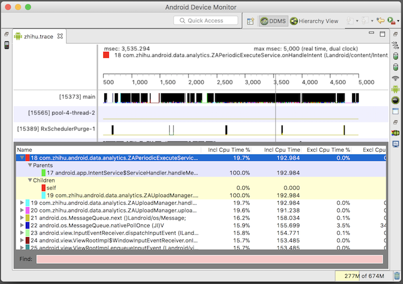

MethodTracerCli is a command-line interface of Android Studio's method tracer.
You can run it independently without Android Studio.
It's very useful when you want to do method tracing on a non-gui environment.
So you can use it in your test or CI scripts.


You can download the jar in [here](https://github.com/nekocode/MethodTracerCli/releases).
And then you can run the jar with the `-h` option to see the usage message:
```
usage: MethodTracer.jar <app-name> [-a <adb_path>] [-e <device-serial>]
       [-h] [-i <sampling-interval>] [-o <out-file>] [-p <port>] [-t <N>]
A command-line interface of android stuido's method tracer
 -a <adb_path>            Path of adb
 -e <device-serial>       Serial number of connected traget device
 -h,--help                Show this help information
 -i <sampling-interval>   The sampling interval of method tracing (can ben
                          0, default is 10)
 -o <out-file>            Output file name (default is "out.trace")
 -t <N>                   Trace application for N seconds
```

After tracing, you can use the `monitor` in the android sdk tools to open the trace file.



If you want to build this project manually, you should make sure that the Android Studio has already been installed and it's version is greater than or equals to 3.0.
Other build information can be found in the [build.gradle](build.gradle).
